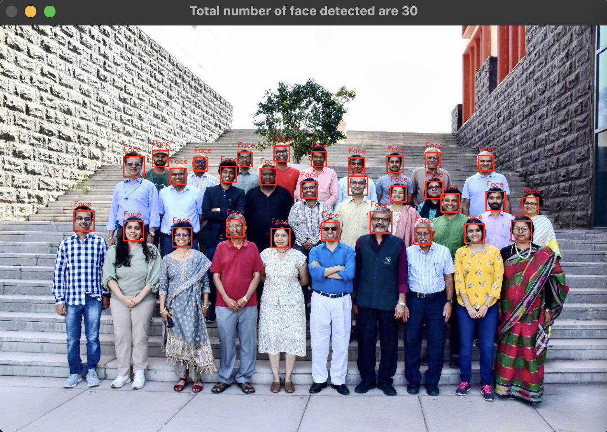
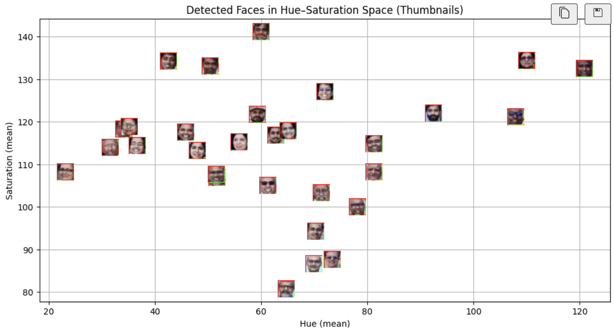
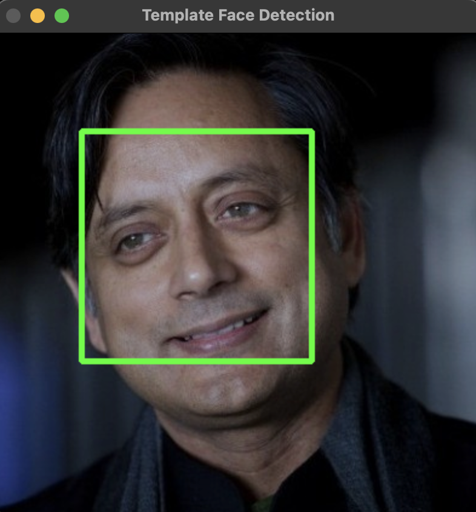

# ManaviNakra_MLPR_Lab5

## Aim
The aim of this assignment is to detect faces in an image, extract color-based features (Hue and Saturation), cluster faces using K-Means clustering, and classify a template image into one of the clusters.

## Methodology

### 1) Face Detection
- Used OpenCV Haar Cascade classifier (`haarcascade_frontalface_default.xml`)
- Converted image to grayscale for detection
- Detected faces were marked with rectangles and labels

### 2) Feature Extraction
- Converted face regions from BGR to HSV color space
- Extracted mean **Hue** and **Saturation** values as features

### 3) Clustering
- Applied **K-Means clustering (k = 2)** on extracted features
- Visualized clusters and centroids in Hue–Saturation space

### 4) Template Image Classification
- Extracted HSV features from `Dr_Shashi_Tharoor.jpg`
- Predicted its cluster using the trained K-Means model

## Key Findings
- Total faces detected: 30
- Faces were grouped into two clusters based on color similarity
- Template image was successfully assigned to one of the clusters

## Visualizations

### Face Detection

### Clustering in Hue–Saturation Space

### Template Image Classification

## Conclusion
Distance-based methods like K-Means can group faces using simple color features such as hue and saturation. While effective for basic grouping, results depend on lighting and image quality. More advanced features could improve robustness in real-world applications.
